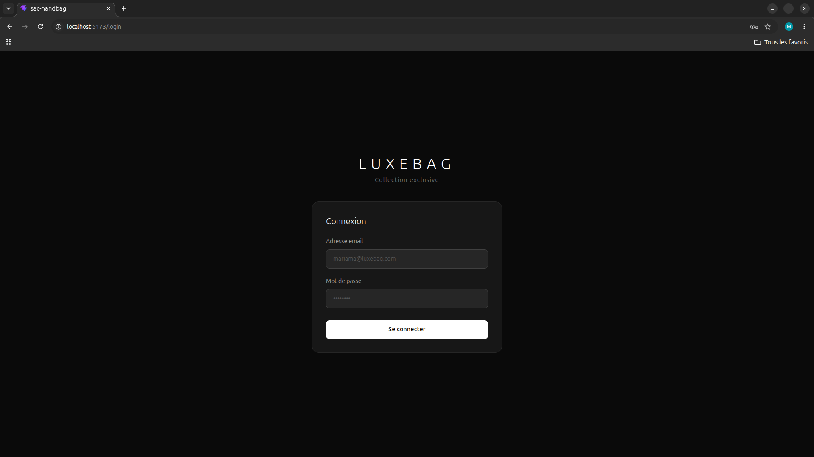
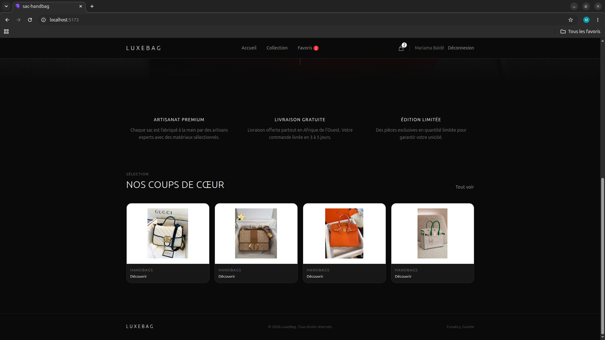
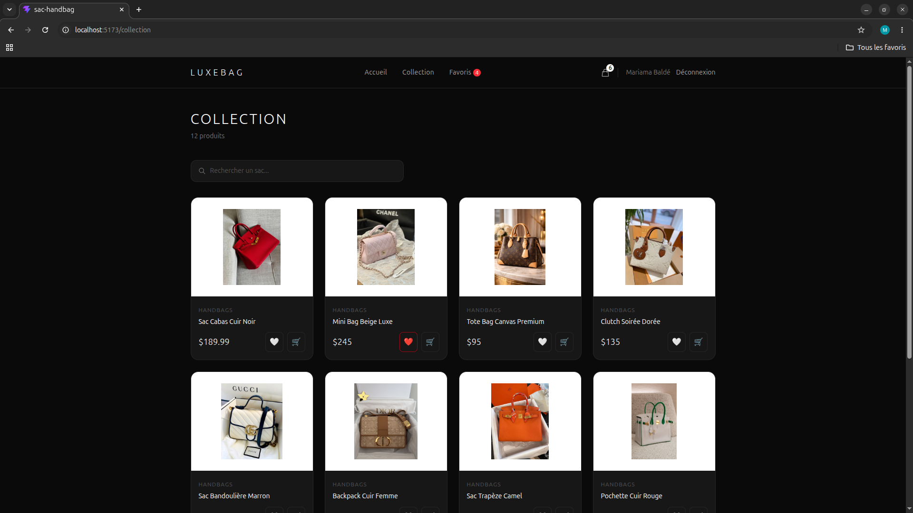
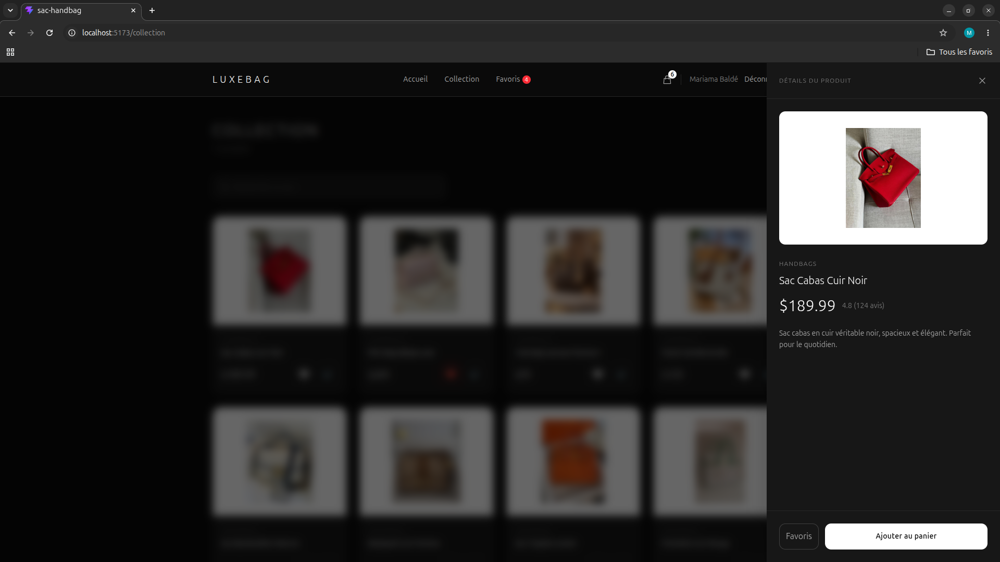
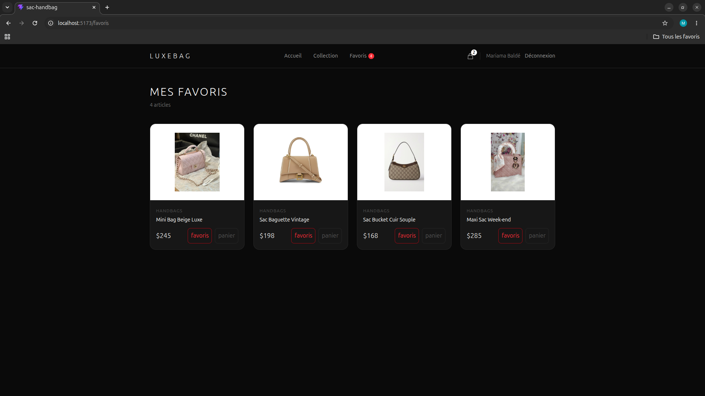
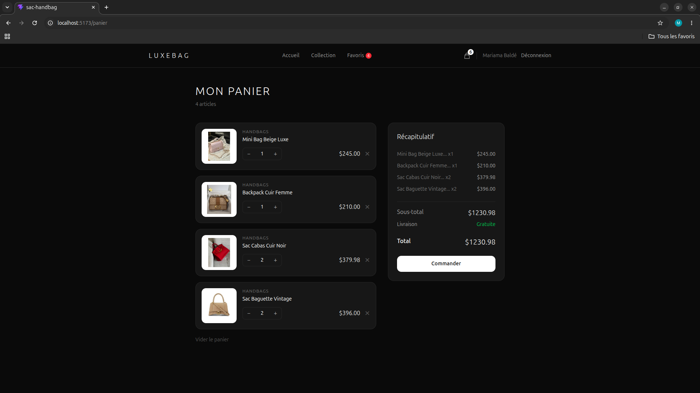

# LuxeBag Store

Une application e-commerce de sacs de luxe construite avec React, Tailwind CSS, Zustand et json-server.

##  Aperçu

###  Login


###  Accueil



###  Collection


### Détails produit (Drawer)


###  Favoris


###  Panier


---

##  Fonctionnalités

-  **Authentification** — Login simulé avec json-server
-  **Collection** — Grille de produits avec recherche en temps réel
-  **Drawer produit** — Détails qui s'ouvrent en panneau latéral droit
-  **Favoris** — Sauvegardés avec Zustand + localStorage
-  **Panier** — Ajout, quantité, total calculé automatiquement
-  **Page Accueil** — Hero section avec aperçu de la collection
-  **Responsive** — Compatible mobile et desktop

##  Stack technique

| Technologie | Rôle |
|---|---|
| React 19 | Interface utilisateur |
| Tailwind CSS 4 | Styles |
| React Router 7 | Navigation |
| Zustand 5 | État global (panier, favoris, auth) |
| Axios | Requêtes HTTP |
| json-server | Backend simulé (auth + produits) |
| Vite 5 | Bundler |

##  Installation

### Prérequis
- Node.js 18+
- npm

### Cloner le projet

```bash
git clone https://github.com/TON_USERNAME/luxebag-store.git
cd luxebag-store
```

### Installer les dépendances

```bash
npm install
```

### Lancer le projet

Dans deux terminaux séparés :

```bash
# Terminal 1 — Frontend React
npm run dev

# Terminal 2 — Backend simulé
npm run server
```

Ouvre [http://localhost:5173](http://localhost:5173)

##  Compte de test

| Email | Mot de passe |
|---|---|
| mariama@luxebag.com | 1234 |

## Structure du projet
src/
├── components/
│   ├── Navbar.jsx          # Navigation + badge panier
│   ├── ProductCard.jsx     # Card produit
│   ├── ProductDrawer.jsx   # Panneau détails (slide droite)
│   └── SearchBar.jsx       # Barre de recherche
├── pages/
│   ├── Home.jsx            # Page accueil hero
│   ├── Collection.jsx      # Grille produits
│   ├── Favorites.jsx       # Page favoris
│   ├── Cart.jsx            # Page panier
│   └── Login.jsx           # Page connexion
├── store/
│   ├── useAuthStore.js     # Auth Zustand
│   ├── usePanierStore.js   # Panier Zustand
│   └── useFavorisStore.js  # Favoris Zustand
├── services/
│   ├── api.js              # Appels produits
│   └── authService.js      # Appels auth
└── App.jsx                 # Routes
db.json                     # Base de données simulée